# Daily Reflection Tree — Visual Diagram

```mermaid
flowchart TD
    START([🌙 START\nGood evening...]) --> A1_OPEN

    A1_OPEN[❓ A1_OPEN\nWeather report for today?] --> A1_ROUTE{🔀 A1_ROUTE}

    A1_ROUTE -->|Sunny / Unpredictable| A1_Q_AGENCY_HIGH
    A1_ROUTE -->|Overcast / Stormy| A1_Q_AGENCY_LOW

    A1_Q_AGENCY_HIGH[❓ A1_Q_AGENCY_HIGH\nWhat drove the good moments?] --> A1_ROUTE2{🔀 A1_ROUTE2}
    A1_Q_AGENCY_LOW[❓ A1_Q_AGENCY_LOW\nFirst instinct in friction?] --> A1_ROUTE2B{🔀 A1_ROUTE2B}

    A1_ROUTE2 -->|Internal answers| A1_Q_SETBACK_INT
    A1_ROUTE2 -->|Luck / external| A1_Q_SETBACK_EXT
    A1_ROUTE2B -->|Control / push| A1_Q_SETBACK_INT
    A1_ROUTE2B -->|Wait / stuck| A1_Q_SETBACK_EXT

    A1_Q_SETBACK_INT[❓ A1_Q_SETBACK_INT\nWhy did the setback happen?] --> A1_REFLECT_INT
    A1_Q_SETBACK_EXT[❓ A1_Q_SETBACK_EXT\nWho/what comes to mind first?] --> A1_REFLECT_EXT

    A1_REFLECT_INT[💬 REFLECT\nYou tend to look inward first...] --> BRIDGE_1_2
    A1_REFLECT_EXT[💬 REFLECT\nThe mind reaches outward first...] --> BRIDGE_1_2

    BRIDGE_1_2([🌉 BRIDGE 1→2\nYou've looked at how you moved...]) --> A2_OPEN

    A2_OPEN[❓ A2_OPEN\nWhere did your energy go today?] --> A2_ROUTE{🔀 A2_ROUTE}

    A2_ROUTE -->|Giving / Executing| A2_Q_CONTRIB
    A2_ROUTE -->|Waiting / Frustrated| A2_Q_ENTITLE

    A2_Q_CONTRIB[❓ A2_Q_CONTRIB\nDid you do something unrequired?] --> A2_ROUTE2{🔀 A2_ROUTE2}
    A2_Q_ENTITLE[❓ A2_Q_ENTITLE\nHow did the day give back?] --> A2_ROUTE2B{🔀 A2_ROUTE2B}

    A2_ROUTE2 -->|Helped / Flagged| A2_REFLECT_CONTRIB
    A2_ROUTE2 -->|Just executed / No extras| A2_REFLECT_NEUTRAL
    A2_ROUTE2B -->|Less than deserved / Fair| A2_REFLECT_ENTITLE
    A2_ROUTE2B -->|Wasn't keeping score| A2_REFLECT_CONTRIB

    A2_REFLECT_CONTRIB[💬 REFLECT\nYou brought more than required...] --> BRIDGE_2_3
    A2_REFLECT_NEUTRAL[💬 REFLECT\nSome days you just execute...] --> BRIDGE_2_3
    A2_REFLECT_ENTITLE[💬 REFLECT\nNoticing the imbalance is honest...] --> BRIDGE_2_3

    BRIDGE_2_3([🌉 BRIDGE 2→3\nWho else was in it with you?]) --> A3_OPEN

    A3_OPEN[❓ A3_OPEN\nWho is in the frame of today's hardest moment?] --> A3_ROUTE{🔀 A3_ROUTE}

    A3_ROUTE -->|Just me| A3_Q_SELF
    A3_ROUTE -->|Others present| A3_Q_OTHER

    A3_Q_SELF[❓ A3_Q_SELF\nWas anyone else quietly struggling?] --> A3_ROUTE2{🔀 A3_ROUTE2}
    A3_Q_OTHER[❓ A3_Q_OTHER\nWhat were you thinking about them?] --> A3_ROUTE2B{🔀 A3_ROUTE2B}

    A3_ROUTE2 -->|Didn't notice / Inside my head| A3_REFLECT_SELF
    A3_ROUTE2 -->|Actually checked in| A3_REFLECT_OTHER
    A3_ROUTE2B -->|How it affected me| A3_REFLECT_SELF
    A3_ROUTE2B -->|What they needed / curious| A3_REFLECT_OTHER

    A3_REFLECT_SELF[💬 REFLECT\nHard days narrow the frame...] --> SUMMARY
    A3_REFLECT_OTHER[💬 REFLECT\nYou made room for someone else...] --> SUMMARY

    SUMMARY[📋 SUMMARY\nYour axis profile + insight] --> END([✨ END\nSee you tomorrow.])

    style START fill:#1a1a2e,color:#eee,stroke:#4a4a8a
    style END fill:#1a1a2e,color:#eee,stroke:#4a4a8a
    style BRIDGE_1_2 fill:#2d4a3e,color:#cde,stroke:#4a8a6a
    style BRIDGE_2_3 fill:#2d4a3e,color:#cde,stroke:#4a8a6a
    style SUMMARY fill:#3a2a1e,color:#fde,stroke:#8a6a4a
    style A1_REFLECT_INT fill:#1e2d4a,color:#cdf,stroke:#4a6a8a
    style A1_REFLECT_EXT fill:#1e2d4a,color:#cdf,stroke:#4a6a8a
    style A2_REFLECT_CONTRIB fill:#1e2d4a,color:#cdf,stroke:#4a6a8a
    style A2_REFLECT_NEUTRAL fill:#1e2d4a,color:#cdf,stroke:#4a6a8a
    style A2_REFLECT_ENTITLE fill:#1e2d4a,color:#cdf,stroke:#4a6a8a
    style A3_REFLECT_SELF fill:#1e2d4a,color:#cdf,stroke:#4a6a8a
    style A3_REFLECT_OTHER fill:#1e2d4a,color:#cdf,stroke:#4a6a8a
```

## Node Type Legend

| Symbol | Type | Description |
|--------|------|-------------|
| 🌙/✨ | `start` / `end` | Session bookends |
| ❓ | `question` | Employee picks one fixed option |
| 🔀 | `decision` | Internal routing — invisible to employee |
| 💬 | `reflection` | Insight text — employee reads and continues |
| 🌉 | `bridge` | Axis transition — auto-advances |
| 📋 | `summary` | End-of-session synthesis |

## Possible Paths

The tree has **8 distinct full paths** through all 3 axes. Every path visits exactly:
- 4 question nodes
- 3 reflection nodes  
- 2 bridge nodes
- 1 summary node
